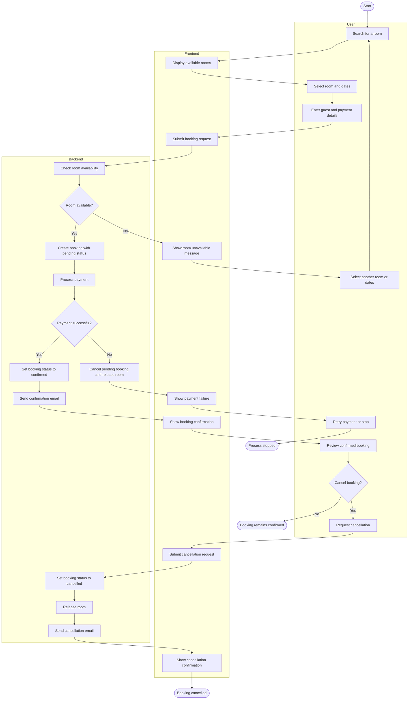

# Booking Creation and Cancellation Process

The diagram describes the booking flow from the user's perspective. It includes the main successful path and exception paths for an unavailable room and a failed payment.

## Covered paths

1. **Happy path:** the room is available, payment succeeds, and the booking becomes confirmed.
2. **Exception 1:** the selected room is unavailable, so the user returns to the search.
3. **Exception 2:** payment fails, so the pending booking is cancelled and the room is released.
4. **Cancellation path:** the user cancels a confirmed booking, after which the room is released and a notification is sent.
