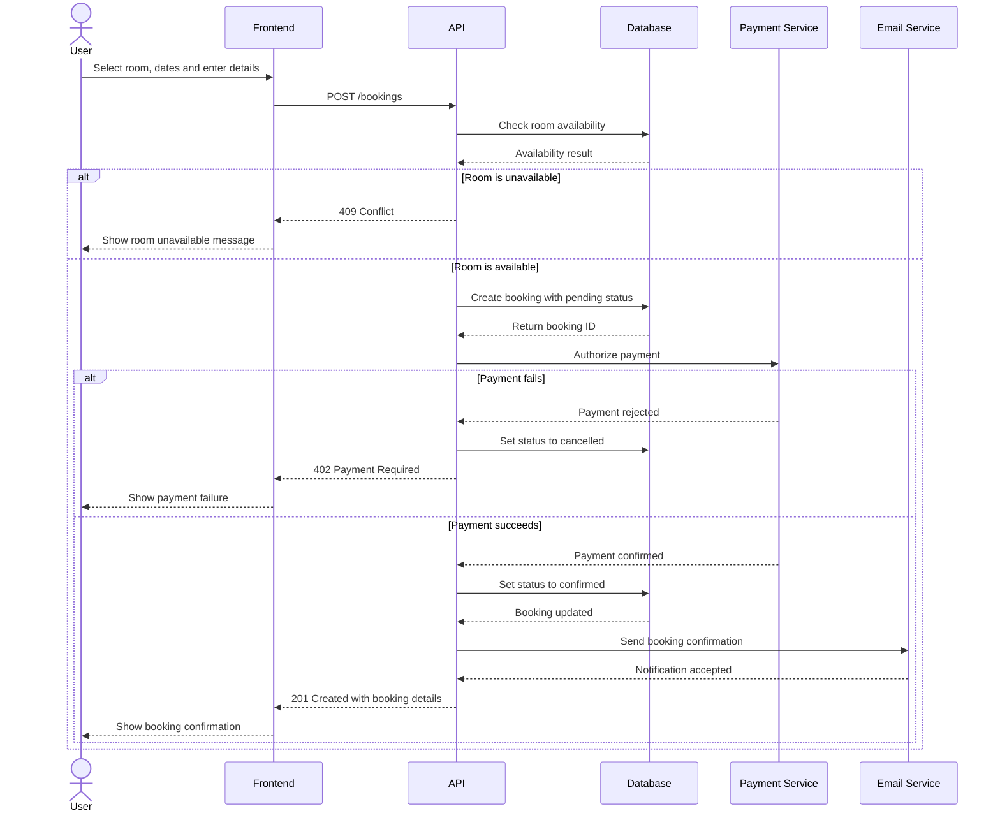

# Booking Creation Sequence Diagram

## Main verification points

* The API checks availability before creating a booking.
* A booking is initially created with `pending` status.
* The status changes to `confirmed` only after successful payment.
* Failed payments do not leave an active booking.
* The confirmation email is sent only after the database update succeeds.
* Error responses are returned to the frontend without exposing internal implementation details.

