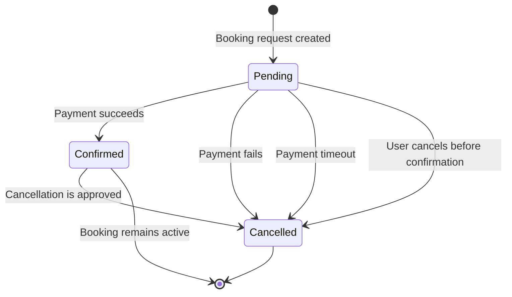

# Booking State Transition Diagram

## Transitions that must be tested

### `Pending → Confirmed`

Verify that a successful payment changes the status exactly once, preserves the booking data and triggers the confirmation notification.

### `Pending → Cancelled`

Test payment rejection, payment timeout and cancellation by the user. The room must be released and the booking must not remain active.

### `Confirmed → Cancelled`

Verify cancellation rules, status update, room availability restoration and cancellation notification.

### Invalid transitions

The following transitions should be rejected:

* `Cancelled → Confirmed`
* `Cancelled → Pending`
* repeated cancellation of an already cancelled booking
* direct creation of a booking in `confirmed` status without successful payment

These checks are important because invalid state transitions can create duplicate reservations, incorrect availability and inconsistent payment records.

