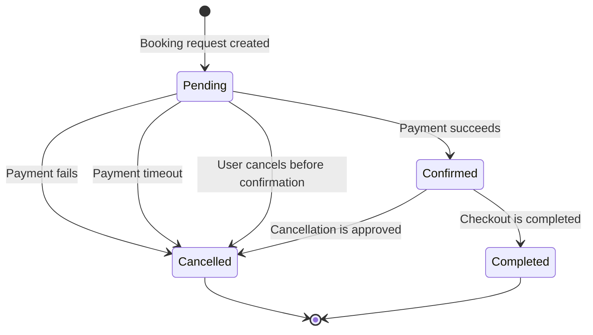

# Booking State Transition Diagram

## Transitions that must be tested

### `Pending → Confirmed`

Verify that a successful payment changes the status exactly once, preserves the booking data, reserves the room, and triggers the confirmation notification.

### `Pending → Cancelled`

Test payment rejection, payment timeout, and cancellation before confirmation. The room must be released and the booking must not remain active.

### `Confirmed → Cancelled`

Verify cancellation rules, status update, room availability restoration, refund handling when applicable, and cancellation notification.

### `Confirmed → Completed`

Verify that a confirmed booking is completed only after the stay has ended and that the historical record remains available.

### Invalid transitions

The following transitions should be rejected:

* `Cancelled → Confirmed`
* `Cancelled → Pending`
* `Completed → Confirmed`
* `Completed → Pending`
* repeated cancellation of an already cancelled booking
* direct creation in `confirmed` status without successful payment

These checks protect room availability, payment consistency, and booking-history integrity.
